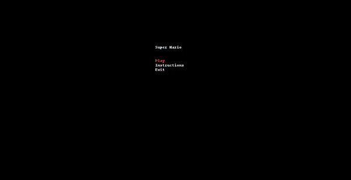
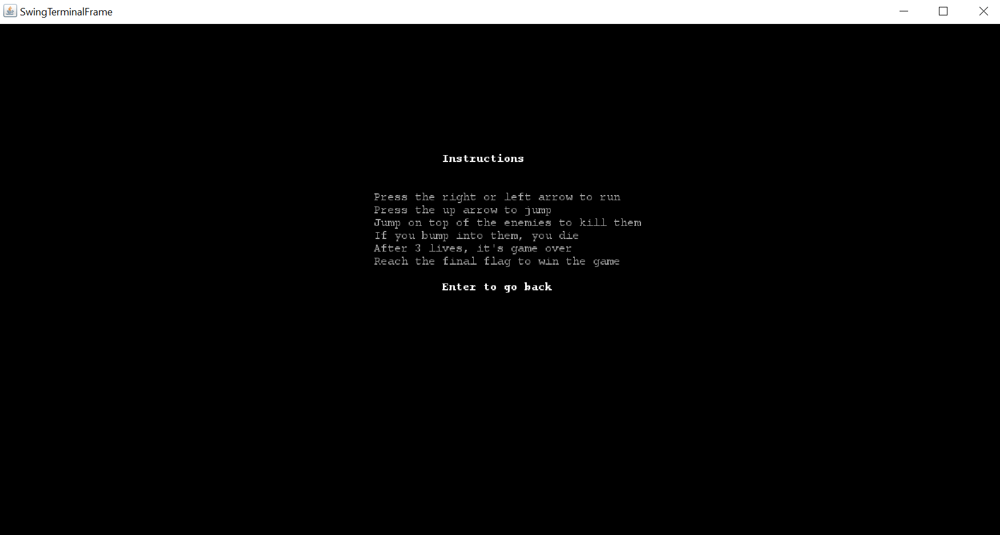
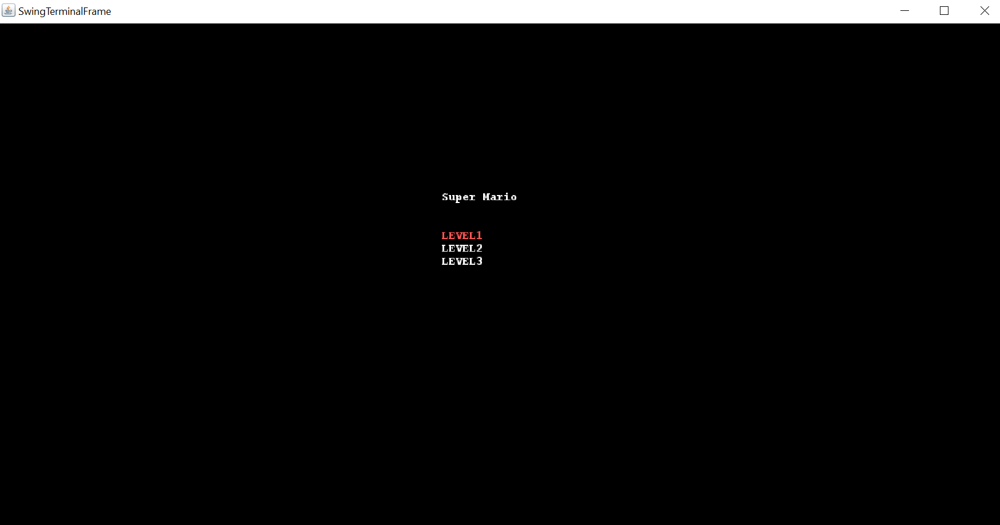
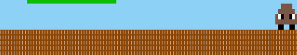
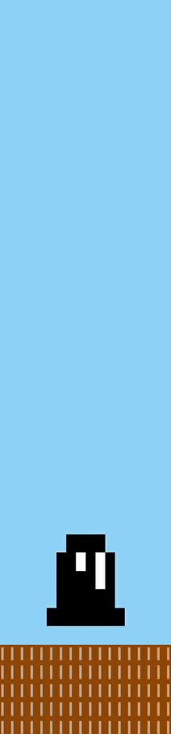
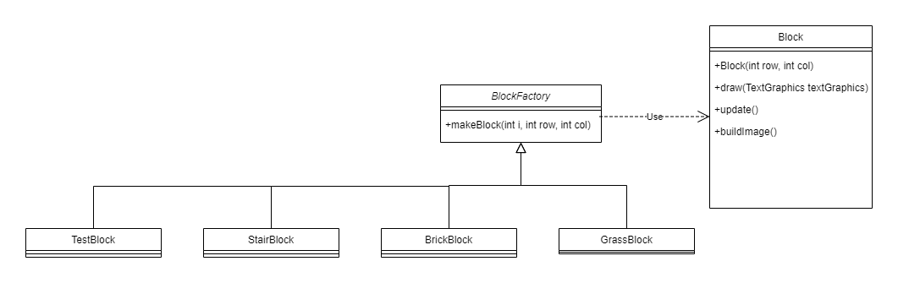
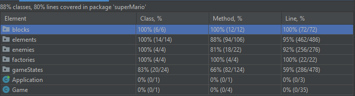

# LDTS_T06_G02 - Super Mario

##Developed by:  
* [Hugo Gomes](https://github.com/Hugo7gomes)  
* [Lia Silva](https://github.com/liavieir)  
* [João Moreira](https://github.com/up202005035)  

## Game Description

The Super Mario is a 2D platformer based game where you have to race through a map and reach a flag in order to win. The map is full of enemies, blocks and platforms. The "hero" can run and jump. If he touches any of the enemies, he will lose a life. After 3 lives lost, he dies.

## Screenshots

The following screenshots ilustrate the general look of our game, as well as the divergent functionalities:
### Game preview

  <b><i>Gif 1. Sneak peak into Super Mario game</i></b>

 
 

### Menus

  

  <b><i>Fig 1. Main Menu </i></b>

  

 
 

  

  <b><i>Fig 2. Instructions Menu </i></b>  

  

 
 

  

  <b><i>Fig 3. Select Level Menu </i></b>  

  

  <b><i>Gif 2. EnemyX movement</i></b>

 
 

  <b><i>Gif 3. EnemyY movement</i></b>

 
 

## Implemented Features

- **Connected Menus** - The user has the option to browse through the different menus (eg.: Main Menu, Levels and Instructions). 

- **Buttons** - Functional and interactive buttons.

- **Keyboard control** - The keyboard inputs are received and interpreted according to the current game state.

- **Player control** - The player can move with the keyboard control.

- **Collisions detection** - Collisions between different objects are verified (eg.: Player, Enemies, Obstacles).

- **Different levels** - different levels with increased difficulty will be implemented.

## Planned Features
All planned features were successfully implemented.

## Design

### General Structure
#### Problem in Context:
Our project's main concern was choosing which patterns would best suit our needs, since our game handles a GUI and is divided into different game states.

#### The Pattern:
Two main patterns were applied to the project: a creational pattern, the Factory Method, that defines an interface for creating an object but lets the subclasses decide wich class to instantiate and a behavioral design pattern, the State Pattern, that allows an object change its behavior without altering its class. 

#### Implementation of State Pattern:
Implementation wise, we have a classe (GameStateManager) that manages all the states and changes the current state depending on the user's input.

  

  <b><i>Fig 4. State pattern design</i></b>

#### Consequences:
The use of State Pattern allows:

- Introduce new states without changing existing state classes or the context (Open/Closed Principle).
- Organize the code related to particular states into separate classes (Single Responsibility Principle).
- Simplify the code of the context by eliminating bulky state machine conditionals.

#### Implementation of Factory Pattern:
To build our arena, we used the Factory Pattern, reading the information from the file and creating dynamically the associated object.

  

  <b><i>Fig 5. Factory pattern design</i></b>

#### Consequences:
Benefits of using this pattern:

- Avoiding tight coupling between the creator and the concrete products.
- Single Responsibility Principle. You can move the product creation code into one place in the program, making the code easier to support.
- Open/Closed Principle. You can introduce new types of products into the program without breaking existing client code.

## Known Code Smells

#### Large Class
Some classes (eg.: LevelState) contain many methods. We find it justifiable as the classes require these fields. 
Because the LevelState class is the main class of our program it needs to store a considerable amount of data and various 
methods are needed in order to the game work. It wouldn't make sense to split it into two separate ones (extract method).

#### Lazy Classes
The BrickBlock, GrassBlock and StairBlock classes don't do almost anything, they're only used to draw the blocks.
Because we used the Factory Method which creates the blocks dynamically neither the Inline Class nor the Collapse Hierarchy treatments would be appropriate.

#### Refused bequest
In order to generalize and simplify our code, we created various abstract classes. As a result, some subclasses inherited methods 
from its parent classes that are not used. For example, FinalFlag Class, the Enemy Class and the LevelState Class.

#### Long method
As we decided to represent our elements as basic text images, in which every character is filled with different colours
based on the image desired, the methods responsible for this turned out to have many lines.

#### Message Chains
When the Game is called, it calls the GameStateManager and if the current state is the LevelState, the Player and consequently the Position are called.
Even though this generates a chain, it is necessary for the game flow. 

## Testing
### Screenshot of coverage report

  

  <b><i>Fig 6. Test Coverage</i></b>

### Link to mutation testing report
[Mutation tests](reports/pitest/202201212340/index.html)

### Self-evaluation
The work was equally divided between the group members.

- Hugo Gomes: 33.3%
- Lia Vieira: 33.3%
- João Moreira: 33.3%
