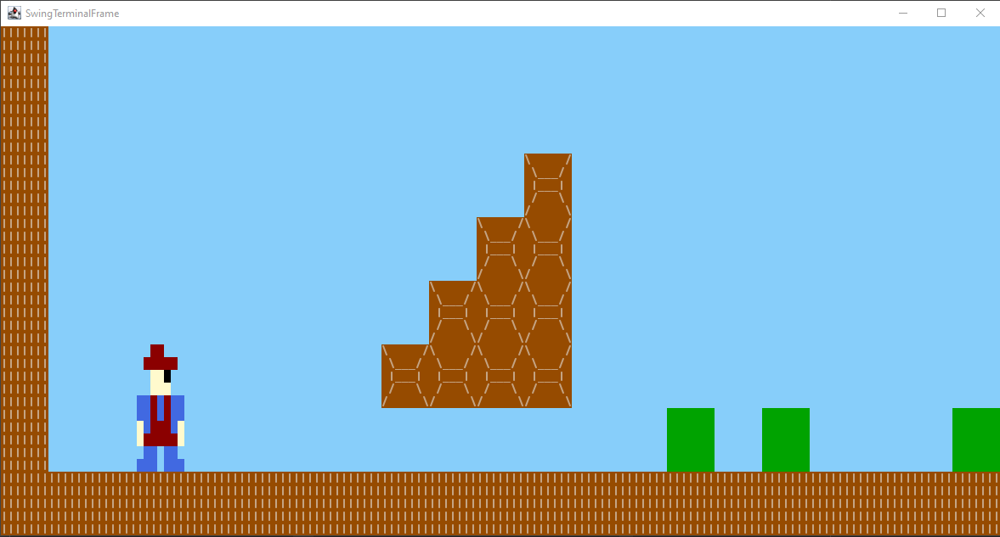
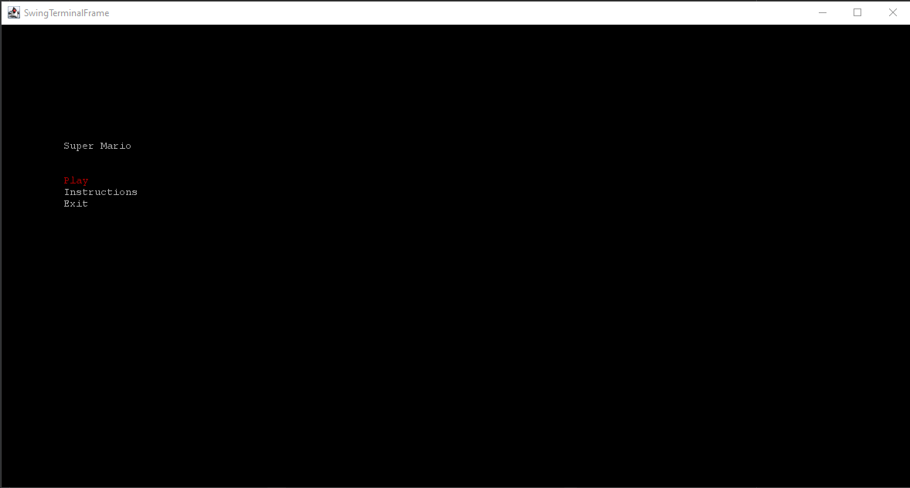
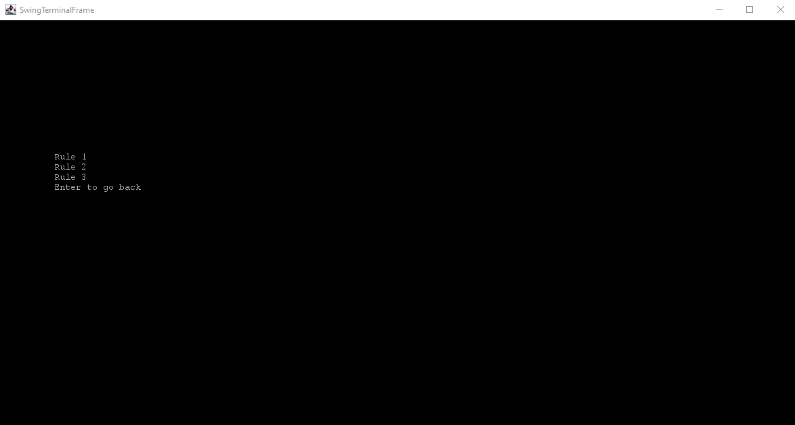
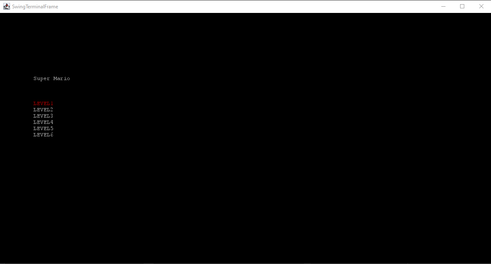

# LDTS_T06_G02 - Super Mario

## Game Description

The Super Mario is a 2D platformer based game where you have to race through a map and reach a flag in order to win. The map is full of enemies, platforms and open holes. The "hero" can run, jump and shoot fire balls. If he touches any of the enemies or falls down a hole, he will lose a life. After 3 lives lost, he dies.

## Screenshots

The following screenshots ilustrate the general look of our game, as well as the divergent functionalities:
### Game preview

  

  <b><i>Fig 1. Sneak peak into Mario game</i></b>

 
 

### Menus

  

  <b><i>Fig 2. Main Menu </i></b>

  

 
 

  

  <b><i>Fig 3. Instructions Menu </i></b>  

  

 
 

  

  <b><i>Fig 4. Select Level Menu </i></b>  

  

## Implemented Features

- **Connected Menus** - The user has the option to browse through the different menus (eg.: Main Menu, Levels and Instructions). 

- **Buttons** - Functional and interactive buttons.

- **Keyboard control** - The keyboard inputs are received and interpreted according to the current game state.

## Planned Features

- **Player control** - The player can move and throw the fire balls with the keyboard control.

- **Collisions detection** - Collisions between different objects are verified (eg.: Player, enemies, Obstacles).

- **Different levels** - different levels with increased difficulty will be implemented.

- **Pause Menu** - The player will be able to pause the game anytime he wants.

## Design

### General Structure
#### Problem in Context:
Our project's main concern was choosing which patterns would best suit our needs, since our game handles a GUI and is divided into different game states.

#### The Pattern:
Two main patterns were applied to the project: a creational pattern, the Factory Method, that defines an interface for creating an object but lets the subclasses decide wich class to instantiate and a behavioral design pattern, the State Pattern, that allows an object change its behavior without altering its class. 

#### Implementation of State Pattern:
Implementation wise, we have a classe (GameStateManager) that manages all the states and changes the current state depending on the user's input.

  

  <b><i>Fig 1. State pattern design</i></b>

#### Consequences:
The use of State Pattern allows:

- Introduce new states without changing existing state classes or the context (Open/Closed Principle).
- Organize the code related to particular states into separate classes (Single Responsibility Principle).
- Simplify the code of the context by eliminating bulky state machine conditionals.

#### Implementation of Factory Pattern:
To build our arena, we used the Factory Pattern, reading the information from the file and creating dynamically the associated object.

  

  <b><i>Fig 1. Factory pattern design</i></b>

#### Consequences:
Benefits of using this pattern:

- Avoiding tight coupling between the creator and the concrete products.
- Single Responsibility Principle. You can move the product creation code into one place in the program, making the code easier to support.
- Open/Closed Principle. You can introduce new types of products into the program without breaking existing client code.

In the future, other patterns will be applied to our project.